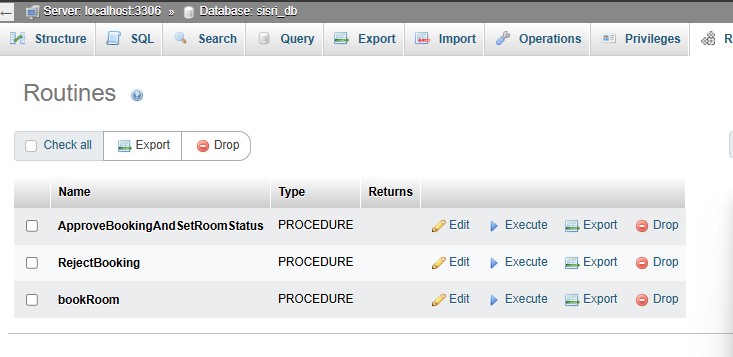
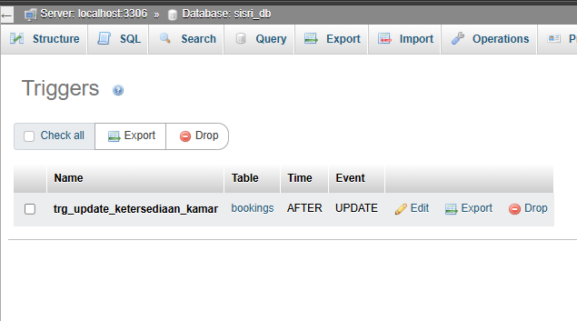

# UAP_PDT - siSRI
**siSRI (Sistem Rekomendasi Indekos)** adalah sebuah platform yang dikembangkan dengan PHP dan MySQL untuk membantu pengguna menemukan indekos ideal mereka. Sistem ini dirancang untuk memberikan rekomendasi yang akurat dan relevan dengan memanfaatkan fitur canggih seperti stored procedure untuk efisiensi pencarian, trigger untuk otomatisasi, transaction untuk memastikan konsistensi data, stored function untuk perhitungan spesifik, serta mekanisme backup otomatis untuk menjaga keamanan data indekos dan pengguna dari hal yang tidak diinginkan.

**DETAIL KONSEP**

**-- TRANSACTION --**

Setiap procedure di SiSRI dilengkapi dengan START TRANSACTION dan COMMIT/ROLLBACK untuk menjamin bahwa proses hanya akan disimpan ke database jika seluruh tahapan berhasil.
Implementasi transaction

    START TRANSACTION;
    
    -- perhitungan harga dan insert booking
    
    IF price IS NULL THEN
        ROLLBACK;
    ELSE
        COMMIT;
    END IF;

**-- STORED PROCEDURE --**

Stored procedure adalah instruksi yang disimpan di database untuk mengeksekusi operasi penting secara otomatis. Dalam sistem terdistribusi, ia menjamin efisiensi, konsistensi, dan keamanan eksekusi antar node dan pengguna.

Beberapa contoh precedure yang digunakan :

bookRoom

Melakukan proses pemesanan dan menghitung total harga secara otomatis. Jika harga tidak ditemukan, transaksi dibatalkan.

    CALL bookRoom(room_id, user_id, start_date, end_date, @total_price);

ApproveBookingAndSetRoomStatus

Menyetujui pemesanan sekaligus mengubah status kamar menjadi terisi.

    CALL ApproveBookingAndSetRoomStatus(booking_id);

RejectBooking

Menolak pemesanan dan melakukan rollback jika status tidak memenuhi syarat.

    CALL RejectBooking(booking_id);

**-- TRIGGERS --**

    CREATE TRIGGER trg_update_ketersediaan_kamar
    AFTER UPDATE ON bookings
    FOR EACH ROW
    BEGIN
        IF NEW.status = 'confirmed' AND OLD.status != 'confirmed' THEN
            UPDATE indekos
            SET status_ketersediaan = 'terisi'
            WHERE id = NEW.room_id;
        END IF;
    
        IF NEW.status = 'rejected' AND OLD.status = 'confirmed' THEN
            UPDATE indekos
            SET status_ketersediaan = 'tersedia'
            WHERE id = NEW.room_id;
        END IF;
    END;

**-- FUNCTIONS --**

CalculateBookingDuration(start_date, end_date) 

Menghitung jumlah hari pemesanan.

    SELECT CalculateBookingDuration('2025-06-15', '2025-06-17'); -- Hasil: 2

CalculateBookingTotalPrice(room_id, start_date, end_date) 

Mengalikan harga per hari dengan durasi, berdasarkan data indekos. 

    SELECT CalculateBookingTotalPrice(1, '2025-06-15', '2025-06-17'); -- Hasil: harga * 2 
    
calculateTotalPrice(room_id, start_date, end_date) 

Fungsi alternatif sederhana dengan perhitungan internal.

