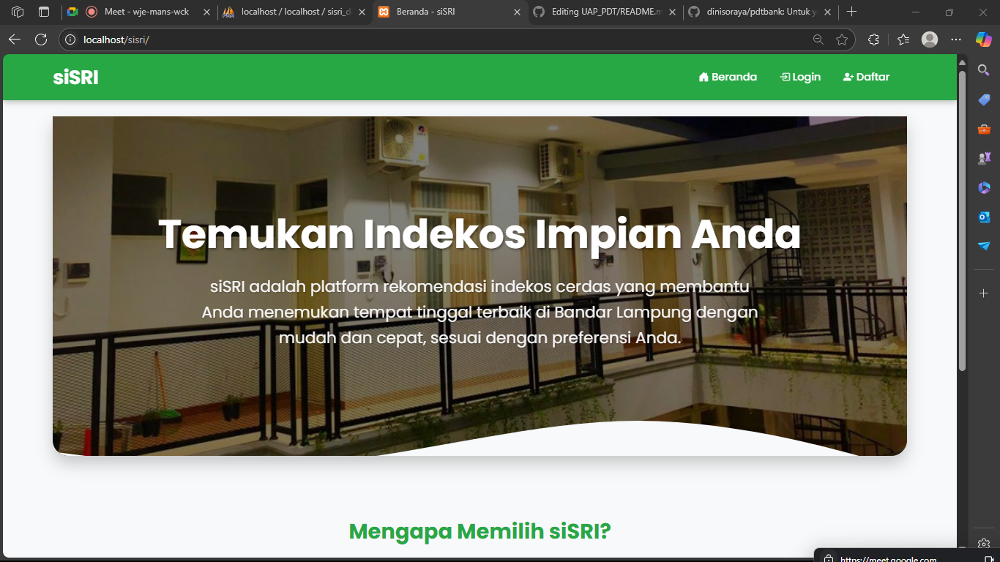

# UAP_PDT - siSRI
siSRI (Sistem Rekomendasi Indekos) adalah sebuah platform yang dikembangkan dengan PHP dan MySQL untuk membantu pengguna menemukan indekos ideal mereka. Sistem ini dirancang untuk memberikan rekomendasi yang akurat dan relevan dengan memanfaatkan fitur canggih seperti stored procedure untuk efisiensi pencarian, trigger untuk otomatisasi, transaction untuk memastikan konsistensi data, stored function untuk perhitungan spesifik, serta mekanisme backup otomatis untuk menjaga keamanan data indekos dan pengguna dari hal yang tidak diinginkan.

